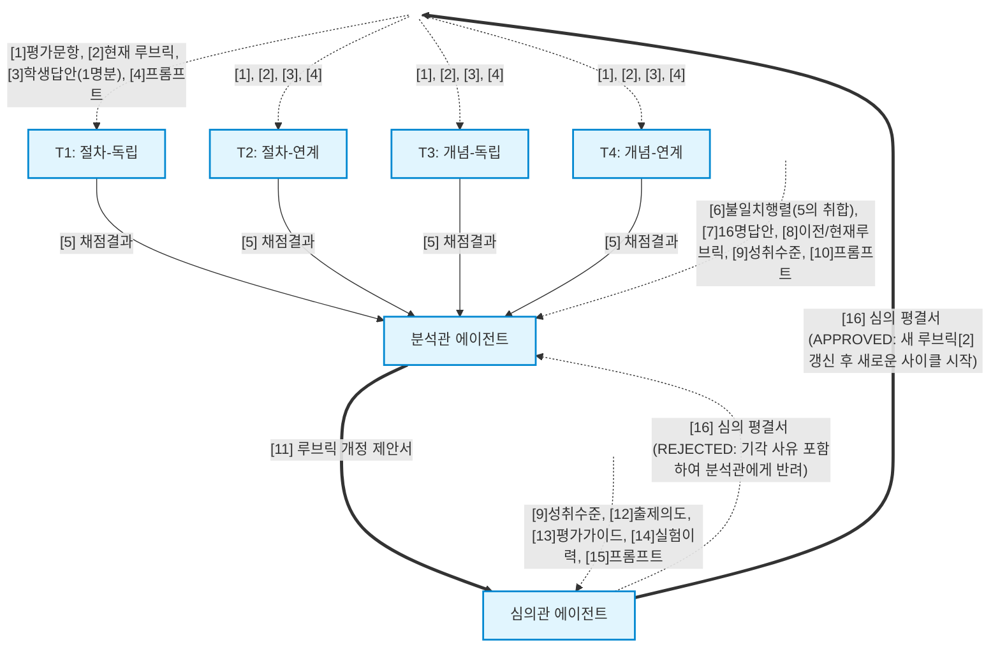

# 시스템 구조 및 정보 흐름도 (Figure 1)

아래 다이어그램은 상자로 표현되는 노드를 오직 '6개의 핵심 에이전트(교사 4명, 분석관, 심의관)'로 엄격히 제한한 채, 표에 기재된 모든 16개의 입출력 문서들이 한 번의 실험 사이클 내에서 어떻게 생산되어 어디로 흘러가는지를 상하 위계(Top-Down) 구조로 완벽히 매핑한 논문용 피겨입니다.

