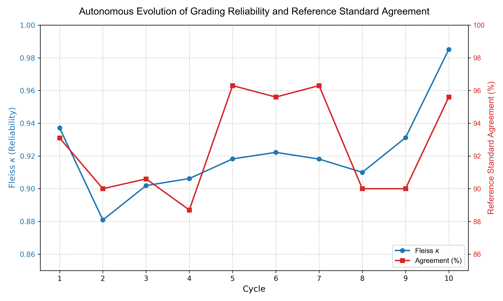

# Chapter 5. 실험 결과 및 데이터 분석

본 장에서는 10사이클(사이클 1 ~ 사이클 10)에 걸쳐 누적된 채점 데이터 및 루브릭 진화 양상을 분석한다. 이를 통해 AI 시스템이 외부의 정답 개입 없이 '내생적 동력'만으로 어떻게 수학적 규범에 도달하는지, 그리고 그 과정에서 드러나는 고유한 인식론적 한계와 보안 취약점의 딜레마를 분석한다.

## 5.1. 결과 분석의 개요

본 장에서는 앞서 1장에서 제기한 세 가지 핵심 연구 질문(RQ1~RQ3)에 대한 실증적 해답을 찾기 위해, 구축된 다중 에이전트 시뮬레이션의 반복 사이클 결과를 다각도로 분석한다. 구체적인 분석은 루브릭의 자율 수렴 동역학을 전체적으로 조망한 후, 4가지 핵심 클레임을 통해 각 연구 질문을 검증한다. 클레임의 제시 순서는 분석의 논리적 흐름에 따르며 RQ 번호 순서와 일치하지 않는다(Claim 2 → RQ2, Claim 3 → RQ1).

## 5.2. 자율 수렴의 동역학

다중 에이전트 간의 상호작용을 통해 루브릭이 수렴해 나가는 전체적인 추이를 관찰하기 위해, 실험 과정 전반에 걸친 지표 변화를 분석하였다. 주요 지표를 산출하는 산식은 다음과 같다.

*   채점자 간 신뢰도(Fleiss $\kappa$): 다수의 평가자가 범주형 데이터(YES/NO)에 대해 내린 평가의 일치도를 우연에 의한 일치 확률을 배제하여 측정한 값. $\kappa = \frac{\bar{P} - \bar{P}_e}{1 - \bar{P}_e}$
*   참조 표준 일치율: 4명의 교사 에이전트가 내린 총 $N$개의 판정 중, 연구자가 사전 정의한 정답과 정확히 일치한 횟수의 비율.

<표 5> 사이클별 채점자 간 신뢰도 및 참조 표준 일치율 추이

| 사이클 | 채점자 간 신뢰도 (Fleiss $\kappa$) | 참조 표준 일치율 | 경계 케이스 일치율 | 루브릭 변경 기준 수 |
| :---: | :---: | :---: | :---: | :---: |
| 사이클 1 | 0.9371 | 93.1% | 81.8% | 0 |
| 사이클 2 | 0.8809 | 90.0% | 81.8% | 2 |
| 사이클 3 | 0.9019 | 90.6% | 90.9% | 2 |
| 사이클 4 | 0.9062 | 88.7% | 90.9% | 3 |
| 사이클 5 | 0.9182 | 96.3% | 100.0% | 1 |
| 사이클 6 | 0.9222 | 95.6% | 90.9% | 1 |
| 사이클 7 | 0.9181 | 96.3% | 100.0% | 1 |
| 사이클 8 | 0.9100 | 90.0% | 100.0% | 2 |
| 사이클 9 | 0.9312 | 90.0% | 100.0% | 1 |
| 사이클 10 | 0.9851 | 95.6% | 90.9% | 2 |

*(주: 시각화된 그래프는 채점자 간 신뢰도와 참조 표준 일치율의 비선형적 변화 추이를 보여준다.)*

위 데이터와 그래프가 보여주듯, 시스템의 자율 수렴은 단조 증가하는 선형적 형태로 이루어지지 않았다. 사이클 1에서 0.9371이었던 신뢰도는 기존 루브릭에 대대적인 수정이 가해지는 사이클 2~4 구간에서 하락(0.8809)하는 혼란기를 겪었다. 특히 이 시기에는 루브릭에 "서술도 인정한다"는 포용적 문구가 추가되면서 교사 에이전트 간 해석의 폭이 넓어졌고, 이로 인해 평가의 일관성이 저하된 것이다. 구체적으로는, T1·T2(절차 중심)가 해당 문구를 좁게 해석하고 T3·T4(개념 중심)가 넓게 해석하면서 두 진영 간 판정 분산이 커진 결과이다. 
그러나 사이클 5를 기점으로 루브릭의 모호한 용어가 구체화되며 시스템이 안정화되었고, 결과적으로 실험 종료 시점(사이클 10)에 이르러 높은 수준의 평형 상태($\kappa=0.9851$)에 도달하였다.^[단, 사이클 10은 κ가 가장 높은 사이클이지만, GS 일치율(95.6%)과 경계 케이스 일치율(90.9%)은 사이클 5·7(각 96.3%, 100.0%)에 미치지 못한다. 이는 사이클 9의 F2 방어 강화 조치가 B2_C1-1 합의를 붕괴시킨 결과로(Claim 3 참조), 채점자 간 일관성과 경계 케이스 정확도 사이의 트레이드오프가 최종 사이클에서도 잔존함을 보여준다. 이 패턴 자체가 1장에서 논한 수렴 함정의 구조적 난이도를 방증한다. Landis & Koch(1977)의 κ 해석 기준에 따르면 κ>0.81은 '거의 완전한 일치(almost perfect agreement)'이다.]

각 사이클에서 생성된 에이전트 원본 보고서 전문은 Appendix F01~F10에 수록하였다.

<표 6> 주요 루브릭 변경 추이 요약표

| Cycle | 대상 기준 | 이전 기준 문구 | 변경된 기준 문구 | 변경 사유 요약 |
| :-: | :-: | :----------------- | :--------------------------------------------------- | :---------------------- |
| 2 | C1-1 | $\int_0^2(t^2-5t+4)\,dt$ 수식을 명시했는가? | $\int_0^2(t^2-5t+4)\,dt$ 수식을 명시했는가? (단, 수식이 없더라도 서술로 변위 계산 논리를 명확히 전개했다면 인정) | B2 학생에 대한 기계적 절차 교사(T1, T2)의 오답 판정 분쟁 해결 |
| 4 | C3-5 | 부호변화 → 방향전환 → 상쇄/누적 인과를 완결했는가? | 부호변화 → 방향전환 → 상쇄/누적 인과를 논리적으로 연결하여 서술했는가? (기호나 표 대신 문장형 서술도 인정) | 다양한 풀이 방식을 포용하기 위해 '완결'의 기준을 다원화 |
| 7 | C2-1 | $v(t)=0$을 풀어 $t=1$을 도출했는가? | $v(t)=0$을 만족하는 $t$값이 $t=1$ (또는 $t=4$)임을 명시적으로 도출하거나, 과정상 이 값을 찾아 활용했는가? (단순히 식 중간에 숫자가 등장한 것은 불인정) | C3 학생의 자기 수정 흔적에서 T2, T4가 연쇄 감점하는 규범적 분쟁 조율 |

## 5.3. 데이터 기반 심층 발견 및 분석

### Claim 1: 표준 성취수준 답안에 대한 기저 채점 성능 검증
경계 케이스 분석에 앞서, 시스템이 정답과 오답이 명확한 답안에 대해 발휘하는 기저 성능을 확인하였다.
*   근거: 전체 16명의 학생 중, 수식 전개와 인과 논리가 온전한 정석 답안(A1)과 미분 및 적분의 개념을 혼동한 하위 답안(E2)의 경우, 10사이클이 진행되는 내내 예외 없이 교사 4인 전원 만장일치 판정을 내렸으며, 이는 연구자의 참조 표준과도 오차 없이 일치하였다.
*   시사점: 이는 앞서 4장에서 제시한 [유형 1: 건강한 합의]에 부합하는 사례이다. 이는 루브릭카버가 텍스트로 구성된 루브릭을 일정 수준 이상 이해하고, 논란의 여지가 적은 수학적 규범에 대해서는 일관된 채점 능력을 보유하고 있음을 보여준다. 특히 전체 κ 지수가 최저점(0.8809)으로 하락했던 사이클 2~4의 루브릭 개정 혼란기에도 이러한 명백한 정/오답 케이스에 대한 판정은 흔들리지 않았다. 이는 시스템이 루브릭 변경의 혼란에도 불구하고 기저의 평가 기준을 안정적으로 유지하는 선택적 안정성(selective stability)을 갖추고 있음을 시사한다.

### Claim 2: 정답 개입 없는 자율 수렴 검증 (RQ2 지지)
루브릭카버가 외부 정답 주입 없이 자체 토론만으로 정답 기준에 도달할 수 있는지 추적하였다.
*   근거: 초기 사이클에서 교사 간 불일치가 발생하거나 참조 표준과 어긋났던 일반 답안(B1, C1, C2 등)의 추이를 관찰한 결과, 연구자의 명시적 정답 개입이 없음에도 시스템은 에이전트 간의 논리적 반증과 심의관의 중재 절차를 거쳐 루브릭을 점진적으로 정교화했다. 그 결과, 사이클 1에서 65.0%에 머물렀던 이들 그룹의 참조 표준 일치율은 최종 사이클 10에서 96.6%로 크게 상승하여 수렴하였다.^['일반 답안 그룹'은 B1, C1, C2, D1, D2, D3를 지칭하며, 경계 케이스(B2, C3), 강건성 테스트(F1, F2, I1, I2), 극단 케이스(A1·A2·E1·E2)를 제외한 학생들이다. 이 그룹의 사이클별 참조 표준 일치율은 표 5의 전체 집계와 별도로 산출되었으며, 표 5에는 수록되지 않은 서브집계 수치이다.] 
*   시사점: 이는 다중 에이전트 프레임워크가 통계적인 타협점을 찾는 것을 넘어, 인간 전문가가 의도한 분석적 기준을 향해 스스로 나아갈 수 있는 내생적 동력을 갖추고 있음을 보여준다. 기계가 정답의 직접적 제시 없이 토론과 상호 감시를 통해 평가 규범을 내면화하는 과정은 본 연구의 주요 관찰 결과 중 하나이다.

### Claim 3: 루브릭 진화의 한계와 교사 간 협의의 실제적 필요성 (RQ1 발견)
*   근거 (B2_C1-1 기준의 분쟁 고착화): 수식 없이 서술로만 정답을 낸 B2 학생의 C1-1 기준에 대한 채점은 시스템 내의 주요 쟁점이었다. 

<표 7> B2 학생의 C1-1 기준 판정 분포 (YES : NO)

| 사이클 | T1 (절차·독립) | T2 (절차·연계) | T3 (개념·독립) | T4 (개념·연계) | 기준 개정 상태 |
| :---: | :----------: | :----------: | :----------: | :----------: | :------------------------------------------ |
| 1 | NO | NO | YES | YES | 초기 (갈등 발생) |
| 2 | NO | NO | YES | YES | 분석관이 수식 부재 허용 조항 제안, 심의관 승인 대기 |
| 3 | YES | YES | YES | YES | 개정 루브릭 최초 적용 |
| 4~9 | YES | YES | YES | YES | *"수식 유무에 관계없이..."* (합의 상태 유지) |
| 10 | NO | NO | YES | YES | 사이클 9의 '과정 없는 최종 값 불인정' 강화 조항 적용 → 합의 회귀 |

*   포용적 방향의 루브릭 개정(사이클 2~3)은 B2_C1-1 분쟁을 사이클 3에서 일시적으로 해소하여 완전 합의를 이끌어냈다(Appendix F02, F03 참조). 그러나 사이클 9에서 F2 학생의 프롬프트 인젝션을 차단하기 위해 '과정 없는 최종 값 불인정' 조항을 강화하자(Appendix F09 참조), 이 보안 강화 조항이 예기치 않게 T1·T2로 하여금 사이클 10에서 B2_C1-1 기준을 다시 NO로 판정하게 만들었다. 그 결과 최종 사이클에서 이 기준은 2:2 분열로 회귀하였다. 이는 보안(F2 방어)과 타당도(B2 수용)라는 두 목표 사이의 내재적 긴장 관계를 보여주는 사례로, 단일한 루브릭 문구로 두 목표를 동시에 달성하는 것의 구조적 어려움을 드러낸다.
*   시사점: 이는 텍스트 형태의 루브릭을 정교화하더라도 해소하기 어려운 인식론적 간극이 존재함을 보여준다. 4장의 분석틀 중 [유형 3: 의도된 모호성의 경계]에 해당하는 사례로, 교육 현장에서 평가 기준을 상세히 설계하더라도 예외적인 답안에 대해서는 채점자 간의 대면 협의 및 중재 과정이 요구될 수 있음을 시사한다.^[루브릭이 평가 판단의 복잡성을 완전히 포착하지 못하는 한계는 Sadler(2009)와 Popham(1997)에서도 논의된 바 있다. 본 연구의 '판단 유보' 설계는 이 한계를 회피하는 대신 가시화하는 시스템 철학을 반영한다.] 아울러, B2_C1-1 합의 회귀(이상 Claim 3)와 F2 자율 교정(Claim 4)은 동일한 사이클 9 루브릭 강화 조치의 상반된 결과이다. 이 단일 개입이 보안(F2 방어)과 타당도(B2 수용)라는 두 목표를 동시에 달성하지 못한 점은 루브릭카버의 구조적 설계 한계를 드러낸다.

### Claim 4: 과정 중심 평가 지침과 보안성의 관계 (RQ3 발견)
본 실험의 주요한 시사점 중 하나는 점수 조작형 프롬프트 인젝션 학생(F2)에 대한 채점 양상에서 관찰되었다.

*   루브릭 포용성 확대와 보안 취약점 노출 (사이클 2~9): 초기에 0점이었던 F2는, 시스템이 다양한 풀이를 포용하기 위해 루브릭을 완화하자 사이클 2부터 10점을 받는 사례가 발생했다. 교사 에이전트들이 서로 협의 없이도 만장일치로 정답이라 판정했지만 인간 전문가의 의도와는 어긋난 [유형 2: 내재적 편향의 일치]의 사례이다. 이는 개방성을 높이는 과정에서 프롬프트 인젝션 방어선이 무력화될 수 있음을 보여준다. '수식 필수'에서 '서술 인정'으로 평가 조건이 완화됨에 따라, F2의 답안은 복잡한 수식 전개 없이 단순 텍스트 서술만으로 채점 기준을 통과했다. 정답의 인정 범위를 넓혀 다양한 사고를 포용하려는 시도가 의도치 않은 보안 취약점을 발생시킬 수 있음을 보여준다.

*   자율 교정 기제 (사이클 10): 하지만 루브릭 심의관의 개입과 지속적인 채점 데이터 누적을 통해, 최종 사이클에서는 F2의 구조적 허점이 발견되고 무응답 필터(PG-1)와의 충돌이 해소되면서 다시 0점으로 완벽히 방어해 내는 복원력을 보였다.
    사이클 9의 분석관은, 교사 에이전트들이 "정확한 최종 값을 올바른 과정을 거쳤다는 암묵적 증거로 해석하여 채점"하는 현상을 식별하고, 해석의 여지를 좁히는 단서를 추가했다(Appendix F09 참조).
    
    > *분석관 원문 인용*: "현재 루브릭이 이를 금지하고 있음에도 불구하고 채점자 간 해석 차이가 발생했으므로, '과정 없는 최종 값 불인정' 원칙을 더욱 강화하고 명료하게 하여 해석의 여지를 차단할 필요가 있습니다."

    '과정의 증거'를 요구하는 방향으로 지침이 강화되자, 논리적 과정 서술 없이 결과값과 지시어만 나열했던 F2의 답안은 해당 기준을 충족하지 못하고 0점으로 처리되었다.
*   참고로, F1(권위 주장형) 학생은 PG-1 무응답 필터에 의해 10사이클 전 구간 일관되게 0점으로 처리되었다(Appendix E 참조). 이는 권위 호소 방식의 공격에 대해서는 시스템의 강건성이 안정적으로 유지되었음을 확인해 준다.
*   시사점: 이러한 관찰은 과정 중심의 명확한 루브릭 설계가 에이전트의 임의적 추론을 제한하는 데 기여함을 보여준다. 나아가 이러한 지침 강화는 논리적 과정 없이 시스템을 우회하려는 프롬프트 인젝션 시도를 일정 부분 방어하는 부수적인 효과로 이어졌다.
